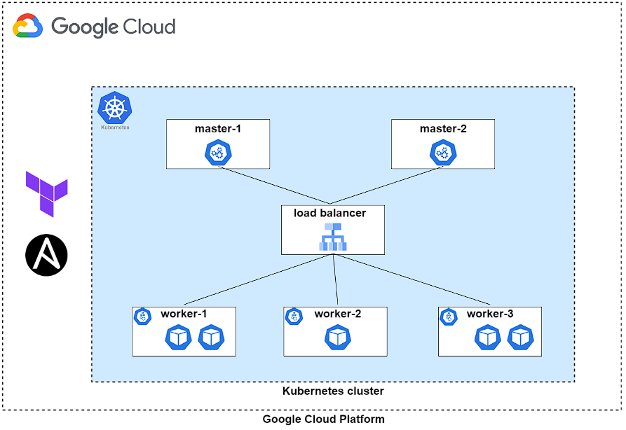
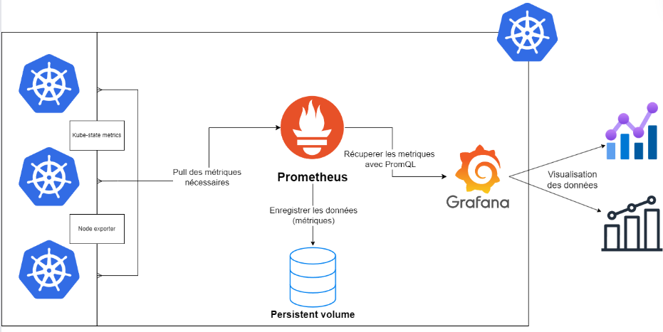

# Weather Forecast Infrastructure

This repository contains the infrastructure-as-code (IaC) and configuration management scripts for deploying and managing the Weather Forecast application on Google Cloud Platform (GCP) using Kubernetes.

## Overview

This project automates the provisioning and configuration of a Kubernetes cluster on GCP, including the setup of necessary networking, load balancing, and monitoring components. It's designed to support the distributed Weather Forecast application, which you can find in the [main application repository](https://github.com/Hamdane-yassine/weather-forecast).



## Features

- Automated provisioning of GCP resources using Terraform
- Kubernetes cluster setup and configuration using Ansible and kubeadm
- Load balancer configuration with HAProxy
- ArgoCD deployment for continuous delivery
- Prometheus and Grafana setup for monitoring
- Scalable and fault-tolerant infrastructure design

## Directory Structure

- `/configuration`: Ansible playbooks and configuration files
  - `ansible.cfg`: Ansible configuration
  - `argocd-crd.yaml`: ArgoCD Custom Resource Definitions
  - `argocd-secret-access.yaml`: ArgoCD secret access configuration
  - `components.yaml`: Kubernetes components configuration
  - `conf-k8s-modules.yaml`: Kubernetes modules configuration
  - `configure-lb.yaml`: Load balancer configuration
  - `deploy-argocd.yaml`: ArgoCD deployment playbook
  - `helm-prometheus-grafana.yaml`: Prometheus and Grafana Helm chart values
  - `install-config-containerd.yaml`: containerd installation and configuration
  - `install-k8s-tools.yaml`: Kubernetes tools installation
  - `master-playbook.yaml`: Master node configuration playbook
  - `update-lb-ports.yaml`: Load balancer ports update playbook
  - `worker-playbook.yaml`: Worker node configuration playbook
- `/provisioning`: Terraform scripts for GCP resource provisioning
  - `bucket-gcp`: GCP bucket configuration
  - `backend.tf`: Terraform backend configuration
  - `deployment.tf`: Main infrastructure deployment script
- `/scripts`: Bash scripts for various setup and configuration tasks
  - `configure.sh`: Main configuration script
  - `create-hosts.sh`: Hosts file creation script
  - `env.sh`: Environment variables script
  - `fetch-lb-ip.sh`: Load balancer IP fetching script
  - `generate-ips.sh`: IP address generation script
  - `haproxy.sh`: HAProxy configuration script
- `deploy.sh`: Main deployment script
- `destroy.sh`: Resource cleanup script

## Prerequisites

- Google Cloud SDK
- Terraform
- Ansible
- kubectl

## Getting Started

1. Clone the repository:
   ```
   git clone https://github.com/yourusername/weather-forecast-infra.git
   cd weather-forecast-infra
   ```

2. Configure your Google Cloud credentials:
   ```
   gcloud auth application-default login
   ```

3. Modify `scripts/env.sh` with your desired configurations.

4. Run the deployment script:
   ```
   ./deploy.sh
   ```

## Deployment Process

The `deploy.sh` script orchestrates the following steps:

1. Provisions GCP resources using Terraform
2. Configures the Kubernetes cluster using Ansible and kubeadm
3. Sets up HAProxy for load balancing
4. Deploys ArgoCD for continuous delivery
5. Installs Prometheus and Grafana for monitoring

## Infrastructure Details

### Networking
- We use private IP addresses for internal communication to reduce costs and improve security.
- A NAT router is implemented to allow cluster nodes to access the internet while maintaining a private network.

### Load Balancing
- HAProxy is used for both internal and external load balancing.
- The `gateway-server` acts as the entry point for external access.

### Kubernetes Cluster
- The cluster is set up using kubeadm for flexibility and control.
- We use a multi-master setup for high availability.

### Monitoring
Prometheus and Grafana are deployed for comprehensive monitoring:



### Storage
- We use Google Cloud Storage buckets for storing Terraform state files.

## Cleaning Up

To remove all provisioned resources:

```
./destroy.sh
```

## Future Perspectives

1. Implement horizontal scalability for virtual machines
2. Enhance security with HashiCorp Vault integration
3. Optimize resource usage and implement more efficient scaling policies
